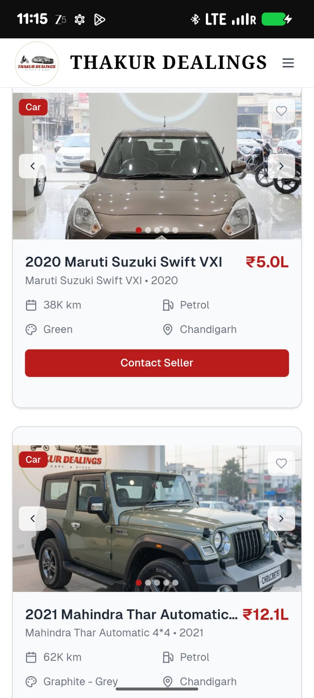
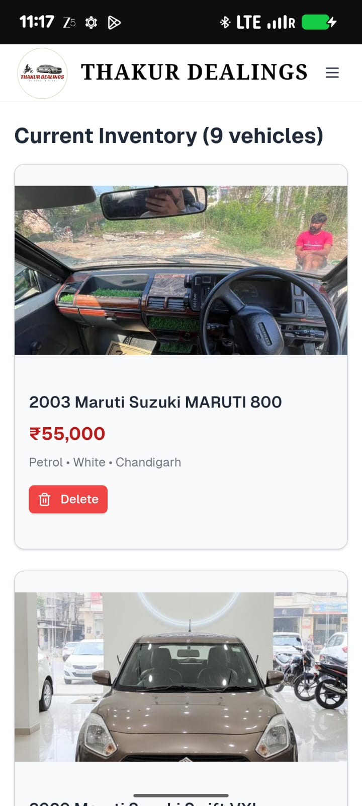
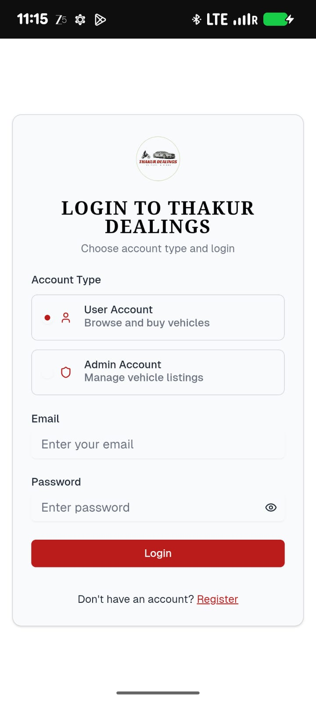

# Thakur Dealings - Vehicle Reselling Platform

---

##  Overview

**Thakur Dealings** is a modern vehicle reselling platform built with **React**, **Next.js**, and **Firebase**.  
The platform allows users to buy and sell cars and bikes efficiently while providing admins full control over vehicle listings.  

The project is hosted on **Firebase Hosting** with **Firestore** for real-time data management.

---

##  Live Site
Check out the deployed website here: [https://thakur-dealings.web.app](https://thakur-dealings.web.app)

---

##  Features

### User Features
- Browse cars and bikes available for sale.
- Contact owners directly to inquire or purchase a vehicle.
- Reach out to Thakur Dealings to sell your own vehicle.

### Admin Features
- Add new car and bike listings with detailed specifications.
- Update or remove vehicle listings.
- Manage buyer and seller inquiries efficiently.

---

##  Technology Stack

| Layer | Technology |
|-------|------------|
| Frontend | React, Next.js |
| Backend & Hosting | Firebase Hosting |
| Database | Firebase Firestore |
| Deployment | Firebase `.web.app` domain with HTTPS |

---

##  How It Works
1. **Admin adds vehicles**: Admin inputs cars and bikes into Firestore with relevant details.
2. **Users browse listings**: Users can view all available vehicles.
3. **Contact owners**: Users contact vehicle owners directly to buy.
4. **Sell vehicles**: Users contact Thakur Dealings to list their vehicles.
5. **Admin manages**: Admin reviews and updates listings and inquiries in real-time.

---

##  Screenshots

---

